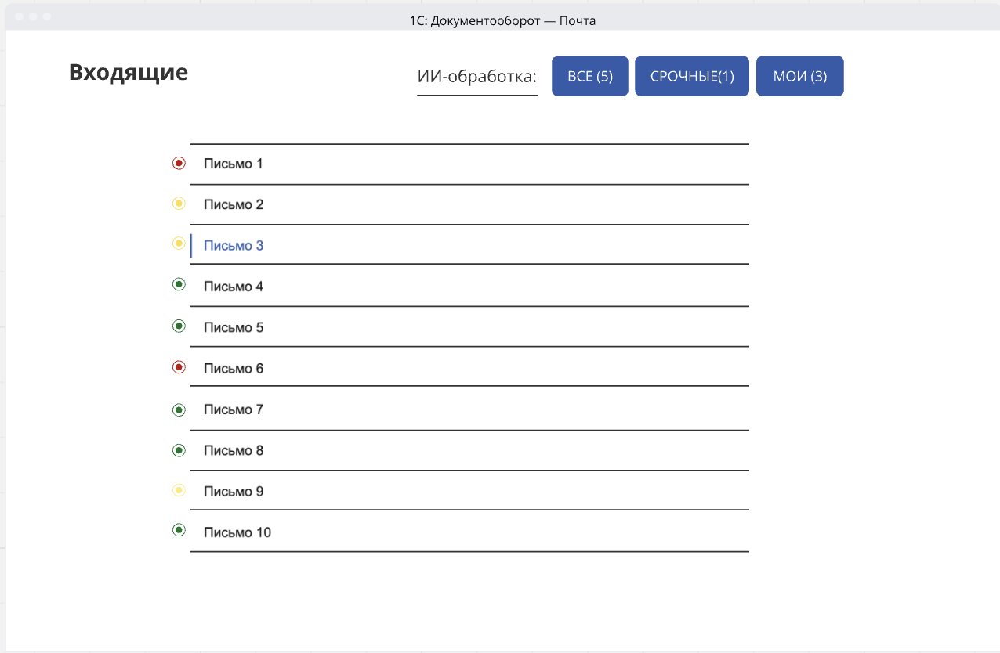
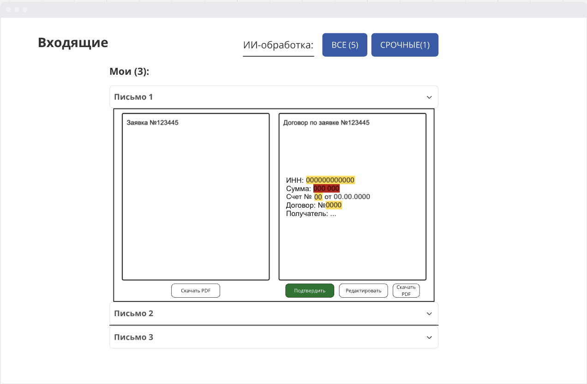

# 2026-VK-EDU-IT-Project-Management-13-Makarovskii

# ИИ-платформа для интеллектуального управления документооборотом коммерческих компаний

---

# Практическое задание №3

### DDD

#### 1. Ядро обработки документов
Получение неструктурированного входящего потока, NLP-классификация, применение правил маршрутизации.

**Глоссарий:**
- **Письмо (Email)** — входящее сообщение с одной или несколькими вложенными скан-копиями (PDF, JPG, PNG).
- **NLP-задача (NlpTask)** — асинхронная задача на классификацию и извлечение реквизитов из письма.
- **Класс документа (DocumentClass)** — тип входящего обращения, который определяет ИИ: `Счет на оплату`, `Договор`, `Доп. соглашение`, `Акт сверки`, `Заявка`, `Жалоба`.
- **Уверенность (Confidence)** — метрика ИИ от 0 до 1, показывающая, насколько модель уверена в правильности классификации и извлеченном реквизите.
- **Правило маршрутизации (RoutingRule)** — динамический алгоритм, который на основе `DocumentClass`, контекста письма (контрагент, регион, сумма) и текущей загрузки отдела назначает задачу на конкретного Исполнителя.

#### 2. Управление задачами бэк-офиса
Назначение, исполнение, контроль сроков классифицированной заявки.

**Глоссарий:**
- **Заявка (Document)** — структурированная задача, созданная на основе письма. Содержит ссылку на оригинал и предзаполненную карточку документа в 1C.
- **Исполнитель (Assignee)** — сотрудник бэк-офиса, ответственный за обработку заявки.
- **Маршрут (Route)** — последовательность действий: `Создана` → `Назначена` → `В работе` → `Исполнена`. Для отказов предусмотрен статус `Переназначена`.
- **SLA-таймер** — допустимое время обработки заявки. При приближении к дедлайну система подсвечивает задачу красным и, если настроено, отправляет на Руководителя.
  

#### 3. Интеграция 
Внедрение нашей модели в 1С.

**Глоссарий:**
- **Коннектор (Connector)** — модуль-плагин для конкретной целевой системы (`1С`).
- **GUI-мастер (Setup Wizard)** — пошаговый интерфейс для IT-администратора заказчика, позволяющий подключить коннектор к 1С без программирования.
- **Пользовательский UI (UserUI)** — нативный интерфейс, встроенный в 1C. Сотрудник работает с обычными формами 1С, дополненными панелями нашей модели.

#### 4. Управление
Всё, что связано с управлением доступом, настройкой рабочей среды и прозрачностью работы ИИ.

**Глоссарий:**
- **Роль (Role)** — уровень доступа: `Операционист`, `Руководитель отдела`, `IT-Администратор`.
- **Лог событий (AuditLog)** — журнал всех действий системы и человека: что ИИ предложил, что человек исправил. Используется для аудита и дообучения модели.

#### 5. Мониторинг и отчётность
Превращение данных о задачах в управленческие метрики для руководителя.

**Глоссарий:**
- **Дашборд руководителя** — наглядная панель с метриками в реальном времени.
- **Метрики эффективности** - входящий поток (кол-во/час), среднее время обработки (AHT), доля просроченных заявок (%).
- **Диаграмма загрузки** — распределение заявок по сотрудникам для поиска неопределённостей.

### BDD

#### 1. Сценарий успеха

Дано
  Сотрудник авторизован в 1С-системе
  И коннектор нашей модели активен
  И в очереди сотрудника есть новая заявка
  И заявка создана ИИ на основе входящего письма
  И ИИ классифицировал документ и извлек все обязательные реквизиты
  И все поля предзаполнены, ошибок нет

Когда
  Сотрудник открывает заявку
  И визуально сверяет данные из письма с предзаполненной карточкой
  И нажимает «Подтвердить и создать»

Тогда
  В 1С создается готовый документ
  И заявка переходит в статус «Исполнена»
  И сотрудник видит уведомление об успешном создании документа
  И в дашборде руководителя обновляются метрики
  И в лог аудита записывается подтверждение с точностью NLP

#### 2. Сценарий отказа

Дано
  Сотрудник авторизован в 1С-системе
  И в очереди сотрудника есть новая заявка
  И ИИ классифицировал документ, но извлек не все реквизиты
  И одно из полей пустое и помечено как обязательное для ручного заполнения
  И кнопка «Подтвердить и создать» заблокирована

Когда
  Сотрудник открывает заявку
  И видит пустое поле с подсветкой «требуется заполнить»
  И вручную вводит недостающее значение
  И нажимает «Подтвердить и создать»

Тогда
  В 1С создается готовый документ с учетом ручного ввода
  И заявка переходит в статус «Исполнена»
  И исправленное значение сохраняется как образец для дообучения ИИ
  И в лог аудита записывается: подтверждение с корректировкой, по какому полю была правка

###Карты страниц

#### 1. Открытое 1С

#### 2. Обработанное ИИ

